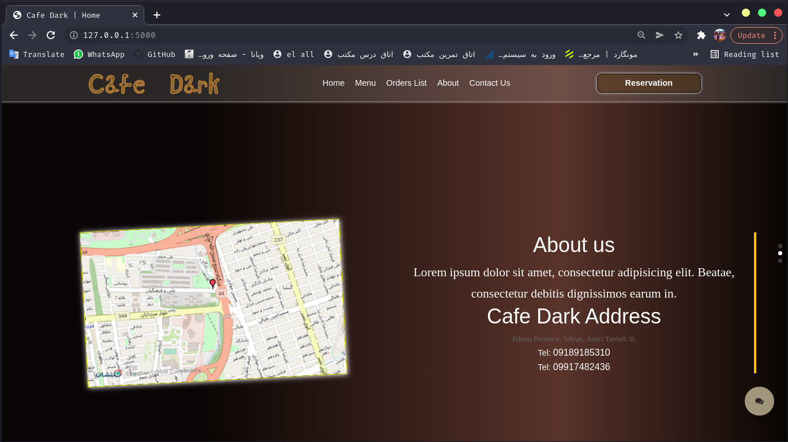

# Cafe Menu - Order System with Flask and PostgreSQL

Welcome to the Cafe Menu project! This web application allows customers to view the cafe menu, place orders, and select a chair to reserve. The menu items are categorized into meals for easy navigation.


## Getting Started

These instructions will help you set up the project locally for development and testing purposes. See deployment for notes on how to deploy the project on a live system.

### Prerequisites

- Docker: Make sure you have Docker installed on your system. You can download it from [here](https://www.docker.com/get-started).

### Installation

1. Clone the repository:

```bash
git clone https://github.com/shayansdq/maktab_64_cafe_project.git
cd maktab_64_cafe_project
 ```
## Run :

```
docker-compose up --build
```

### As You See That's So Easy To Run :)

## ScreenShots :

### 1.home


### 2.About Us



### 3.Contact Us


### 4.Reservation


### 5.Cart


### 6.Order List


### 7.Responsive


